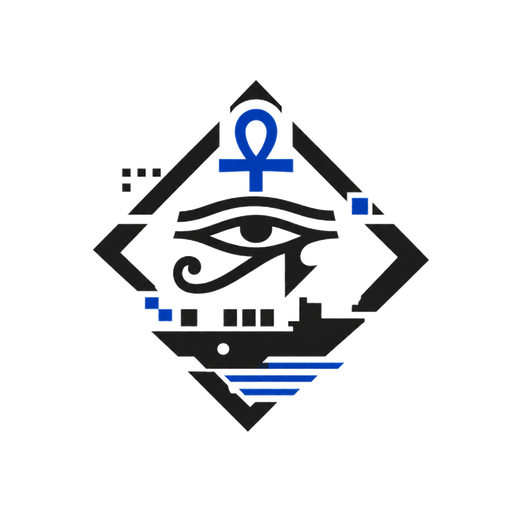

<div align="center">



# 𓅓 Toth

**Blue Team Docker Distribution for DFIR & Threat Hunting**

[](https://github.com/xLxxt/Toth-DFIR)
[](LICENSE)
[]()
[](docs/contributing.md)

*Inspired by [Exegol](https://github.com/ThePorgs/Exegol) - Built for the Blue Side*

</div>

---

## What is Toth ?

**Toth** is a Docker-based distribution designed for Blue Team analysts,
SOC operators and DFIR specialists.

Named after the Egyptian god of knowledge and writing, Toth provides a
ready-to-use, reproducible and collaborative environment for:

- Digital Forensics & Incident Response (DFIR)
- Network Forensics
- Malware Analysis (static & dynamic)
- Threat Hunting
- CTF Blue Team (HackTheBox Sherlock, CyberDefenders, ...)

---

## Images

| Profile   | Image           | Focus                                      |
|-----------|-----------------|--------------------------------------------|
| `base`    | `toth-base`     | Shared tooling, shell and helpers          |
| `dfir`    | `toth-dfir`     | Volatility3, Chainsaw, Hayabusa, Plaso     |
| `malware` | `toth-malware`  | YARA, capa, FLOSS, oletools, DIE           |
| `network` | `toth-network`  | tshark, Zeek, Suricata, tcpdump            |

---

## Installation

One line install (Linux and macOS):

```bash
curl -sSL https://raw.githubusercontent.com/xLxxt/Toth-DFIR/dev/install.sh | bash
```

It installs Toth in `~/.toth`, creates the workspace, builds the base image
and adds the `toth` command to `~/.local/bin`.

Requirements: `git`, `docker`, `python3`.

On Windows, use WSL2 or clone the repository and call the wrapper directly
with `python wrapper\toth.py`.

### Manual install

```bash
git clone --branch dev https://github.com/xLxxt/Toth-DFIR.git
cd Toth-DFIR

make build-base
make build-dfir

make run
```

---

## Usage

```bash
toth update dfir
toth start dfir
toth exec dfir
toth exec dfir vol3 -h
toth stop dfir
toth update
```

`toth exec <profile>` starts the container if needed and drops you into a
shell. Your cases live under `$TOTH_WORKSPACE` (set in `.env`) and are
mounted at `/cases`.

Profiles: `base`, `dfir`, `malware`, `network`.

---

## Architecture support

Images build natively on `amd64` and `arm64` (Apple Silicon included).
Detect It Easy has no Linux arm64 build, so it is installed on amd64 only.

---

## License

Released under the [MIT License](LICENSE).
